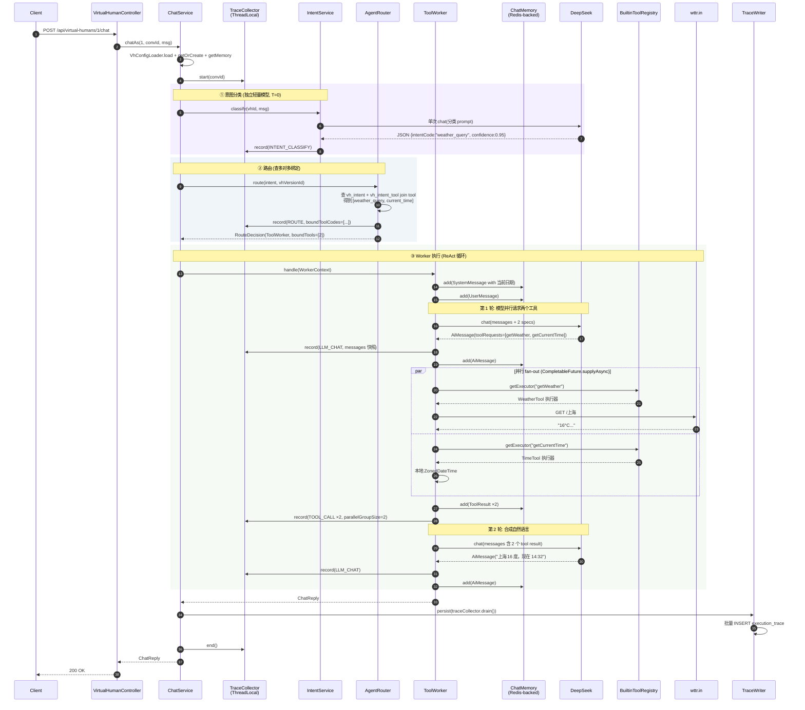
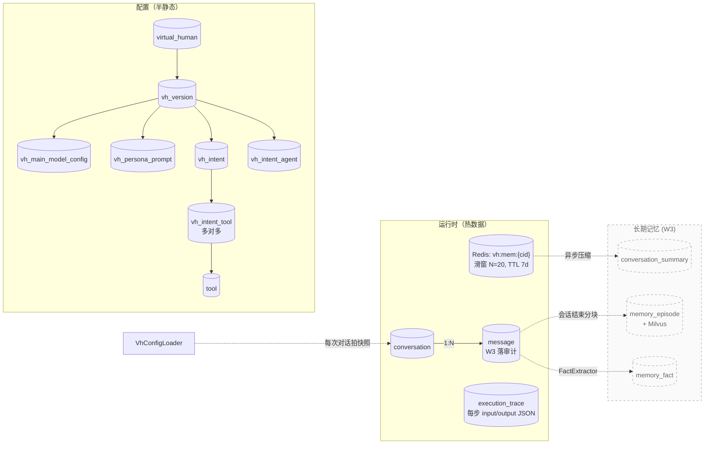

# 架构总览

> 截至 W2 收尾（2026-04-28），已实现的部分用实线框，规划中的部分用虚线框。

## 1. 分层架构

```mermaid
flowchart TB
    Client[["客户端 / curl / chat.html / traces.html"]]

    subgraph Web["Web 层 (com.vh.web)"]
        HC[HealthController]
        CC[ChatController<br/>裸调诊断]
        VHC[VirtualHumanController<br/>active-config / chat / classify-intent]
        TC[TraceController<br/>列会话 / 取步骤]
    end

    subgraph Runtime["Runtime 层 (com.vh.runtime)"]
        direction TB

        subgraph ChatPkg["chat"]
            ChatSvc[ChatService<br/>chatAs / chatAsStream / rawChat]
            ConvSvc[ConversationService]
        end

        subgraph IntentPkg["intent"]
            IntentSvc[IntentService<br/>独立模型 + JSON 输出]
        end

        subgraph AgentPkg["agent"]
            Router[AgentRouter<br/>按意图选 Worker]
            Chatter[ChatterWorker<br/>纯人设单次 LLM]
            ToolW[ToolWorker<br/>多 spec ReAct + 并行 fan-out]
        end

        subgraph TracePkg["trace"]
            Collector[TraceCollector<br/>ThreadLocal 收集]
            Writer[TraceWriter<br/>批量落 execution_trace]
        end

        subgraph CfgPkg["config"]
            CfgLoader[VhConfigLoader<br/>DRAFT / PUBLISHED]
            PromptComp[SystemPromptComposer<br/>注入当前日期]
        end

        subgraph MemPkg["memory"]
            MemFactory[ChatMemoryFactory<br/>MessageWindow N=20]
            RedisStore[RedisChatMemoryStore]
        end

        subgraph ModelPkg["model"]
            ModelFactory[ChatModelFactory<br/>provider→ChatModel/Streaming 缓存]
        end

        subgraph ToolPkg["tool"]
            ToolReg[BuiltinToolRegistry<br/>反射注册 @Tool, 双索引]
            Weather[WeatherTool]
            Time[TimeTool]
            Calc[CalculatorTool]
        end

        ChatSvc --> CfgLoader
        ChatSvc --> ConvSvc
        ChatSvc --> MemFactory
        ChatSvc --> IntentSvc
        ChatSvc --> Router
        ChatSvc --> Collector
        ChatSvc --> Writer
        IntentSvc --> ModelFactory
        Router --> Chatter
        Router --> ToolW
        Chatter --> ModelFactory
        Chatter --> PromptComp
        ToolW --> ModelFactory
        ToolW --> ToolReg
        ToolW --> PromptComp
        Chatter --> Collector
        ToolW --> Collector
        Router --> Collector
        IntentSvc --> Collector
        MemFactory --> RedisStore
        ToolReg --> Weather
        ToolReg --> Time
        ToolReg --> Calc
    end

    subgraph Repo["Repository 层 (com.vh.repository)"]
        direction LR
        VHMap[VirtualHumanMapper]
        VerMap[VhVersionMapper]
        ModMap[VhMainModelConfigMapper]
        PerMap[VhPersonaPromptMapper]
        IntMap[VhIntentMapper]
        IntAgMap[VhIntentAgentMapper]
        IntToolMap[VhIntentToolMapper<br/>多对多绑定]
        ToolDefMap[ToolDefMapper]
        ConvMap[ConversationMapper]
        TraceMap[ExecutionTraceMapper<br/>+ 会话聚合查询]
    end

    subgraph Infra["基础设施"]
        direction LR
        MySQL[("MySQL 8<br/>配置 + 会话 + trace")]
        Redis[("Redis 7<br/>STM 滑窗 / TTL 7d")]
        DeepSeek(("DeepSeek<br/>OpenAI 兼容协议"))
        Wttr(("wttr.in<br/>免 key 天气"))
    end

    subgraph Planned["规划中 (W3~W4)"]
        direction TB
        Summarizer["Summarizer<br/>滚动摘要 (W3)"]
        Episodic["EpisodicMemory<br/>历史 chunk + 向量召回 (W3)"]
        Semantic["SemanticMemory<br/>用户事实抽取 (W3)"]
        CostTrack["CostTracker<br/>token / 成本聚合 (W4)"]
        Eval["Evaluator<br/>20 条 golden case (W4)"]
        Milvus[("Milvus 2.3<br/>向量库 (W3)")]
    end

    Client --> Web
    Web --> Runtime
    TC --> TraceMap

    CfgLoader --> VHMap
    CfgLoader --> VerMap
    CfgLoader --> ModMap
    CfgLoader --> PerMap
    IntentSvc --> IntMap
    IntentSvc --> IntAgMap
    Router --> IntMap
    Router --> IntToolMap
    ConvSvc --> ConvMap
    Writer --> TraceMap

    VHMap & VerMap & ModMap & PerMap & IntMap & IntAgMap & IntToolMap & ToolDefMap & ConvMap & TraceMap --> MySQL
    RedisStore --> Redis
    ModelFactory -.HTTPS.-> DeepSeek
    Weather -.HTTPS.-> Wttr

    Episodic -.W3.-> Milvus

    classDef planned stroke-dasharray: 5 5,fill:#fafafa,stroke:#999,color:#666
    class Planned,Summarizer,Episodic,Semantic,CostTrack,Eval,Milvus planned
```

## 2. 一次 `chatAs` 调用的完整时序

以「上海现在多少度，几点了」为例，演示 Intent → Router → ToolWorker 三段式 + 单轮 LLM_CHAT 内多工具并行调用。

**几个关键点**：
- 整条链路有 **5 步 trace**（INTENT_CLASSIFY × 1, ROUTE × 1, LLM_CHAT × 2, TOOL_CALL × 2），每步带 input/output JSON，`/traces.html` 上点开就能看
- **并行**真正发生在第 1 轮 LLM_CHAT 之后：`CompletableFuture.allOf` 同时跑两个工具，总耗时 ≈ max(两个工具) 而非 sum。前提是模型在单轮内一次性吐多个 `ToolExecutionRequest`（DeepSeek 沿用 OpenAI 兼容协议支持）
- **意图分类用独立模型**：与主模型解耦，方便降本（用 deepseek-chat T=0），主对话可换更贵的（W4 接 fallback 时再说）
- `MAX_ITERATIONS=4` 仍保留，防止模型在工具循环里失控
- `SystemPromptComposer` 在首轮 SystemMessage 末尾追加 "今天是 2026-04-28 星期二..."，避免模型不知道日期乱猜（曾出现"临近秋天"的 bug）

## 3. 数据流：配置 vs 运行时

## 4. 当前 vs 规划

| 模块 | W1 (已完成) | W2 (已完成) | W3 (规划) | W4 (规划) |
|---|---|---|---|---|
| 对话编排 | 单一 ChatService 内嵌 ReAct | ✅ IntentService → AgentRouter → Chatter/ToolWorker 三段式 | — | — |
| 工具 | BuiltinToolRegistry 反射 3 个工具 | ✅ vh_intent_tool 多对多, ToolWorker 单轮 fan-out 真并行 | — | — |
| 记忆 | STM (Redis 滑窗) | — | + Summary / Episodic / Semantic 三层 | — |
| 模型 | DeepSeek 单 provider | — | — | + Claude/Qwen 多源 + fallback |
| 观测 | SLF4J 文本日志 | ✅ execution_trace 落库 + traces.html 可视化 (含完整 messages 快照) | — | + Cost 聚合 + Eval pipeline |
| 系统提示 | 静态人设 | ✅ SystemPromptComposer 注入运行时日期 | — | — |
| 鉴权 | 无 (hardcode tenant=1) | — | — | RBAC + 多租户隔离 |

## 5. 关键设计决策（面试讲法）

1. **为什么不用 Dify？** 工作流形态固定（意图→工具/人设），变的是参数；Java 栈下跨语言成本高、动态 DSL 构建别扭。LangChain4j 提供足够抽象，少一个服务要部署。
2. **为什么手写 ReAct 循环而不是 `AiServices` 自动？** 可观测——每一步 trace 埋点要落 `execution_trace` 表（每条带 input/output JSON 含完整 messages 快照），`AiServices` 内部黑盒，干预成本高。手写也方便加 max iteration、重试、降级策略。
3. **为什么 Redis + MySQL 双写？** Redis 是热路径上的滑窗（TTL 7d），承担每轮 LLM 上下文组装的低延迟读写；MySQL 是冷路径的审计/对账，配合 W3 的 `memory_episode` 长期向量化。两者职责不重叠。
4. **为什么 `vh_version` 走快照而不是全量字段拷贝？** 配置量小、JSON 字段多，正规化到几张子表（`vh_main_model_config`、`vh_persona_prompt`、`vh_intent`...）查询和编辑都更顺手。`virtual_human` 主表用 `draft_version_id` / `published_version_id` 两个唯一指针保证「至多一个 DRAFT、一个 PUBLISHED」。
5. **为什么意图智能体独立配置模型？** 意图分类对成本/精度的偏好不同于主对话——可能用更便宜的模型（如 deepseek-chat T=0），主对话可以挑更贵的。设计上让两者解耦。
6. **为什么意图与工具是多对多而不是单值 FK？** V1 schema 用 `vh_intent.bound_tool_id` 单值 FK 实现，跑通 ReAct 后发现并行执行块（`CompletableFuture.allOf`）名义并行实质串行——模型只能见一个 spec，不可能在单轮内吐多个 `ToolExecutionRequest`。V5 迁到 `vh_intent_tool` 多对多，把全部 active spec 注册给模型，单轮 fan-out 时 wall-clock ≈ max(各工具) 而非 sum。trace UI 上 `parallelGroupSize` 字段显式标注。
7. **为什么往 system prompt 注入当前日期？** LLM 不知道当下时间会按训练数据分布乱猜（线上观察到春天的 4 月被回成"临近秋天"）。`SystemPromptComposer` 在每个会话首轮 SystemMessage 末尾追加"今天是 yyyy-MM-dd 周X"，把时间相关的回答钉死在运行时事实上。
8. **为什么 trace 走 ThreadLocal `TraceCollector` + 出口批量持久化？** 同步主流程下 ThreadLocal 收集 + 出口一次性 `INSERT` 多行，避免热路径上每步同步 IO；流式回调跨线程不可用 ThreadLocal，因此流式入口直接构 `ExecutionTrace` 走 `TraceWriter` 单步落库，是个有意识的非对称。

## 6. 后续待办

- W3 四层记忆系统（亮点 #1）：Summary 滚动摘要 / Episodic 向量召回 / Semantic 用户画像
- W4 成本统计 + 评估 pipeline + demo 视频
- 低优：流式 + 意图路由合流（`chatAsStream` 接 Worker 链路，要解决"工具阶段是否推流"的 UX 问题，当前 chat.html 已切回非流式跑通完整链路）

> 图本身用 Mermaid，GitHub 直接渲染。如需 Excalidraw 风格的导出，可在 [excalidraw.com/+mermaid](https://excalidraw.com) 粘贴上面任意 mermaid block 转换。
