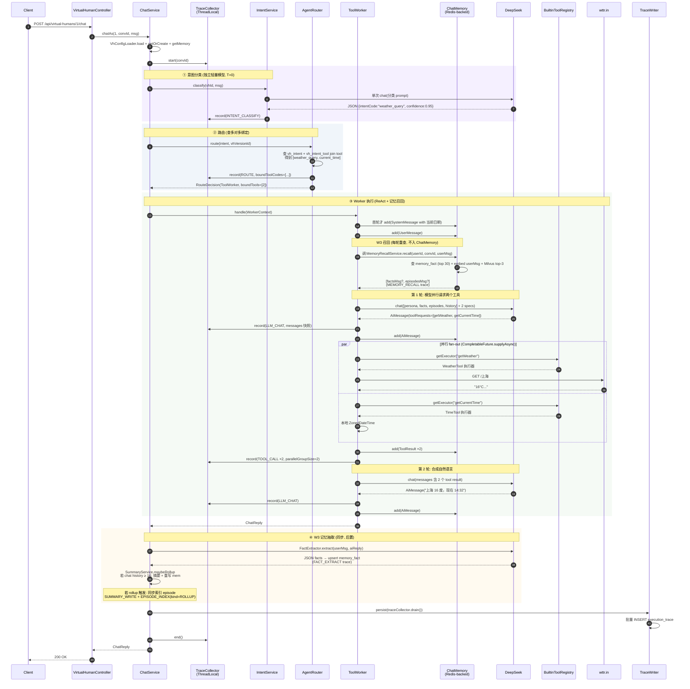
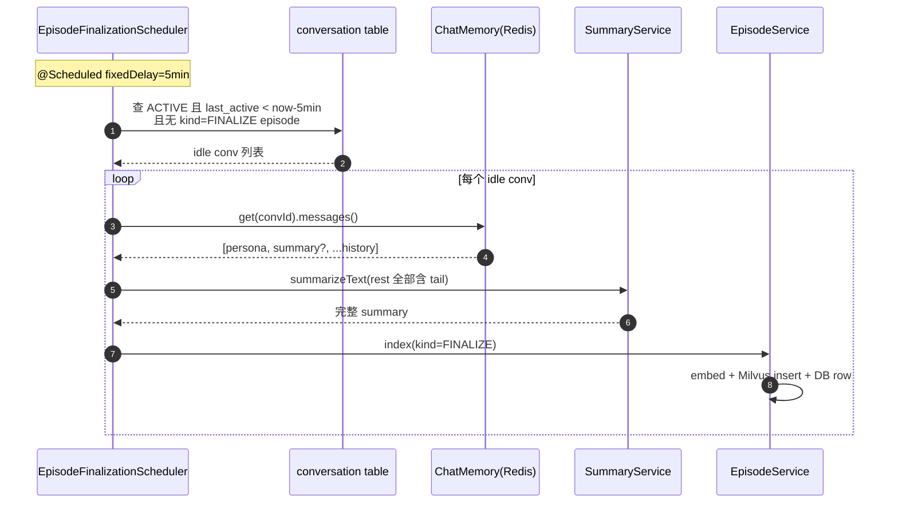
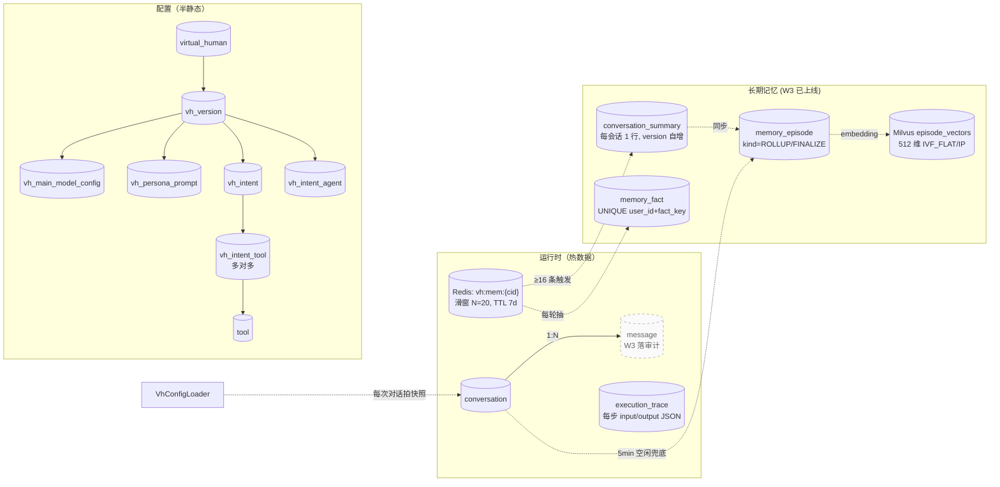

# 架构总览

> 截至 W4 收尾（2026-05-06），已实现的部分用实线框，规划中的部分用虚线框。

## 1. 分层架构

```mermaid
flowchart TB
    Client[["客户端 / curl / chat.html / traces.html"]]

    subgraph Web["Web 层 (com.vh.web)"]
        HC[HealthController]
        CC[ChatController<br/>裸调诊断]
        VHC[VirtualHumanController<br/>active-config / chat / classify-intent]
        TC[TraceController<br/>列会话 / 取步骤]
    end

    subgraph Runtime["Runtime 层 (com.vh.runtime)"]
        direction TB

        subgraph ChatPkg["chat"]
            ChatSvc[ChatService<br/>chatAs / chatAsStream / rawChat]
            ConvSvc[ConversationService]
        end

        subgraph IntentPkg["intent"]
            IntentSvc[IntentService<br/>独立模型 + JSON 输出]
        end

        subgraph AgentPkg["agent"]
            Router[AgentRouter<br/>按意图选 Worker]
            Chatter[ChatterWorker<br/>纯人设单次 LLM]
            ToolW[ToolWorker<br/>多 spec ReAct + 并行 fan-out]
        end

        subgraph TracePkg["trace"]
            Collector[TraceCollector<br/>ThreadLocal 收集]
            Writer[TraceWriter<br/>批量落 execution_trace]
        end

        subgraph CfgPkg["config"]
            CfgLoader[VhConfigLoader<br/>DRAFT / PUBLISHED]
            PromptComp[SystemPromptComposer<br/>注入当前日期]
        end

        subgraph MemPkg["memory (含 W3 四层)"]
            MemFactory[ChatMemoryFactory<br/>MessageWindow N=20<br/>STM]
            RedisStore[RedisChatMemoryStore]
            Summary[SummaryService<br/>滚动摘要 / Summary 层]
            Recall[MemoryRecallService<br/>facts + episodes 召回注入]
            FactX[FactExtractorService<br/>用户事实抽取 / Semantic 层]
            EpisodeSvc[EpisodeService<br/>向量索引 / Episodic 层]
            FinalizeSched[EpisodeFinalizationScheduler<br/>5min 空闲兜底]
            Milvus[MilvusEpisodeStore<br/>向量库客户端]
            EmbModel[EmbeddingModel<br/>BGE-small-zh-v15 / 512 维]
        end

        subgraph ModelPkg["model"]
            ModelFactory[ChatModelFactory<br/>provider→ChatModel/Streaming 缓存]
        end

        subgraph ToolPkg["tool"]
            ToolReg[BuiltinToolRegistry<br/>反射注册 @Tool, 双索引]
            Weather[WeatherTool]
            Time[TimeTool]
            Calc[CalculatorTool]
        end

        ChatSvc --> CfgLoader
        ChatSvc --> ConvSvc
        ChatSvc --> MemFactory
        ChatSvc --> IntentSvc
        ChatSvc --> Router
        ChatSvc --> Summary
        ChatSvc --> FactX
        ChatSvc --> Collector
        ChatSvc --> Writer
        IntentSvc --> ModelFactory
        Router --> Chatter
        Router --> ToolW
        Chatter --> ModelFactory
        Chatter --> PromptComp
        Chatter --> Recall
        ToolW --> ModelFactory
        ToolW --> ToolReg
        ToolW --> PromptComp
        ToolW --> Recall
        Summary --> EpisodeSvc
        Summary --> ModelFactory
        FactX --> ModelFactory
        Recall --> EmbModel
        Recall --> Milvus
        EpisodeSvc --> EmbModel
        EpisodeSvc --> Milvus
        FinalizeSched --> Summary
        FinalizeSched --> EpisodeSvc
        FinalizeSched --> MemFactory
        Chatter --> Collector
        ToolW --> Collector
        Router --> Collector
        IntentSvc --> Collector
        Summary --> Collector
        FactX --> Collector
        Recall --> Collector
        EpisodeSvc --> Collector
        MemFactory --> RedisStore
        ToolReg --> Weather
        ToolReg --> Time
        ToolReg --> Calc
    end

    subgraph Repo["Repository 层 (com.vh.repository)"]
        direction LR
        VHMap[VirtualHumanMapper]
        VerMap[VhVersionMapper]
        ModMap[VhMainModelConfigMapper]
        PerMap[VhPersonaPromptMapper]
        IntMap[VhIntentMapper]
        IntAgMap[VhIntentAgentMapper]
        IntToolMap[VhIntentToolMapper<br/>多对多绑定]
        ToolDefMap[ToolDefMapper]
        ConvMap[ConversationMapper]
        TraceMap[ExecutionTraceMapper<br/>+ 会话聚合查询]
        SumMap[ConversationSummaryMapper]
        FactMap[MemoryFactMapper]
        EpisodeMap[MemoryEpisodeMapper]
    end

    subgraph Infra["基础设施"]
        direction LR
        MySQL[("MySQL 8<br/>配置 + 会话 + trace<br/>+ summary/fact/episode")]
        Redis[("Redis 7<br/>STM 滑窗 / TTL 7d")]
        MilvusInfra[("Milvus 2.3<br/>向量库 / 512 维 IVF_FLAT")]
        Etcd[("etcd<br/>Milvus 元数据")]
        MinIO[("MinIO<br/>Milvus 对象存储")]
        DeepSeek(("DeepSeek<br/>OpenAI 兼容协议"))
        Wttr(("wttr.in<br/>免 key 天气"))
    end

    subgraph W4Pkg["W4: cost / fallback / eval"]
        direction TB
        CostDec["CostTrackingChatModel<br/>装饰器, 自动落 cost_record"]
        CostTrk[CostTracker<br/>按 vh.pricing.* 折算 USD]
        Fallback["FallbackChatModel<br/>多 tier 顺序退路"]
        Echo["EchoChatModel<br/>末位兜底, 永不抛"]
        EvalRunner["EvalRunner @Profile(eval)<br/>20 条 golden case 跑批"]
        EvalEng["EvalAssertionEngine<br/>读 execution_trace 做断言"]
    end

    Client --> Web
    Web --> Runtime
    TC --> TraceMap

    CfgLoader --> VHMap
    CfgLoader --> VerMap
    CfgLoader --> ModMap
    CfgLoader --> PerMap
    IntentSvc --> IntMap
    IntentSvc --> IntAgMap
    Router --> IntMap
    Router --> IntToolMap
    ConvSvc --> ConvMap
    Writer --> TraceMap
    Summary --> SumMap
    FactX --> FactMap
    Recall --> FactMap
    Recall --> EpisodeMap
    EpisodeSvc --> EpisodeMap
    FinalizeSched --> ConvMap
    FinalizeSched --> EpisodeMap

    VHMap & VerMap & ModMap & PerMap & IntMap & IntAgMap & IntToolMap & ToolDefMap & ConvMap & TraceMap & SumMap & FactMap & EpisodeMap --> MySQL
    RedisStore --> Redis
    Milvus -.gRPC.-> MilvusInfra
    MilvusInfra --> Etcd
    MilvusInfra --> MinIO
    ModelFactory -.HTTPS.-> DeepSeek
    Weather -.HTTPS.-> Wttr

    ModelFactory --> Fallback
    Fallback --> CostDec
    Fallback --> Echo
    CostDec --> CostTrk
    CostTrk --> CostRec[(cost_record)]
    EvalRunner --> EvalEng
    EvalEng --> TraceMap

    classDef planned stroke-dasharray: 5 5,fill:#fafafa,stroke:#999,color:#666
```

## 2. 一次 `chatAs` 调用的完整时序

以「上海现在多少度，几点了」为例，演示 Intent → Router → ToolWorker 三段式 + 单轮 LLM_CHAT 内多工具并行调用 + W3 分层记忆链路。

异步链路（独立于以上请求）：

**几个关键点**：
- 主链路 trace 步骤数（典型 ReAct + 工具）：INTENT_CLASSIFY × 1, ROUTE × 1, MEMORY_RECALL × 1, LLM_CHAT × 2, TOOL_CALL × 2, FACT_EXTRACT × 1, （rollup 时）SUMMARY_WRITE × 1 + EPISODE_INDEX × 1 = 7-9 步
- **并行**真正发生在第 1 轮 LLM_CHAT 之后：`CompletableFuture.allOf` 同时跑两个工具，总耗时 ≈ max(两个工具) 而非 sum
- **MEMORY_RECALL 每轮都跑**：facts 来自 MySQL（DB 一行查询），episodes 来自 Milvus（embed + 向量搜，~300ms）；查到的 SystemMessage 注入 prompt，但**不写回 ChatMemory**——保证 facts/episodes 一旦更新下一轮立刻反映
- **FACT_EXTRACT 每轮都跑**：用 LLM 抽用户事实 upsert，prompt 显式约束「仅从 [用户] 行抽，禁止从 [助手] 行抽」防止污染
- **SUMMARY_WRITE 仅 ≥16 条 chat history 时触发**：内存被改写成 `[persona, summary, last 8]`；同步触发 EPISODE_INDEX(kind=ROLLUP) 索引被压缩段
- **EPISODE_INDEX 还有第二种入口（异步）**：EpisodeFinalizationScheduler 每 5min 扫一次空闲会话，索引整段 chat history 含 tail（kind=FINALIZE）—— 修补 rollup 永远只压缩前半的盲区
- **意图分类用独立模型**：与主模型解耦，方便降本（用 deepseek-chat T=0），主对话可换更贵的
- `SystemPromptComposer` 在首轮 SystemMessage 末尾追加 "今天是 yyyy-MM-dd 周X"，避免模型不知道日期乱猜（曾出现"临近秋天"的 bug）

## 3. 数据流：配置 vs 运行时

> 注: `message` 表(M2M 审计) 仍是规划项. W3 期暂时用 ChatMemory(Redis, TTL 7d) 作为消息源, summary/episode 直接基于 ChatMemory 视图生成.

## 4. 当前 vs 规划

| 模块 | W1 (已完成) | W2 (已完成) | W3 (已完成) | W4 (已完成) |
|---|---|---|---|---|
| 对话编排 | 单一 ChatService 内嵌 ReAct | ✅ IntentService → AgentRouter → Chatter/ToolWorker 三段式 | — | — |
| 工具 | BuiltinToolRegistry 反射 3 个工具 | ✅ vh_intent_tool 多对多, ToolWorker 单轮 fan-out 真并行 | — | — |
| 记忆 | STM (Redis 滑窗) | — | ✅ Summary 滚动摘要 + Episodic 向量召回 + Semantic 用户事实 三层补齐 | — |
| 嵌入 | — | — | ✅ BGE-small-zh-v15 in-process (512 维 ONNX, 无外部 key) | — |
| 向量库 | — | — | ✅ Milvus 2.3 (IVF_FLAT/IP) + etcd + MinIO 三件套 | — |
| 异步任务 | — | — | ✅ EpisodeFinalizationScheduler 5min 兜底索引 | — |
| 模型 | DeepSeek 单 provider | — | — | ✅ FallbackChatModel chain (deepseek-chat → reasoner → echo), 配置可扩 Qwen/Claude |
| 成本 | — | — | — | ✅ CostTrackingChatModel 装饰器 + cost_record 表 + /api/costs/* 三端点 |
| 评估 | — | — | — | ✅ 20 条 golden case YAML + EvalRunner CommandLineRunner + 结构化断言 + JSON 报告 |
| 观测 | SLF4J 文本日志 | ✅ execution_trace 落库 + traces.html 可视化 (含完整 messages 快照) | ✅ 加 SUMMARY_WRITE / FACT_EXTRACT / MEMORY_RECALL / EPISODE_INDEX 四类异步/前置 step | ✅ 成本字段并入 trace UI (按会话/今日/按模型聚合) |
| 系统提示 | 静态人设 | ✅ SystemPromptComposer 注入运行时日期 | ✅ 召回的 facts + episodes 动态注入 (不入 ChatMemory) | — |
| 鉴权 | 无 (hardcode tenant=1) | — | — | 后续: RBAC + 多租户隔离 |

## 5. 关键设计决策（面试讲法）

1. **为什么不用 Dify？** 工作流形态固定（意图→工具/人设），变的是参数；Java 栈下跨语言成本高、动态 DSL 构建别扭。LangChain4j 提供足够抽象，少一个服务要部署。
2. **为什么手写 ReAct 循环而不是 `AiServices` 自动？** 可观测——每一步 trace 埋点要落 `execution_trace` 表（每条带 input/output JSON 含完整 messages 快照），`AiServices` 内部黑盒，干预成本高。手写也方便加 max iteration、重试、降级策略。
3. **为什么 Redis + MySQL 双写？** Redis 是热路径上的滑窗（TTL 7d），承担每轮 LLM 上下文组装的低延迟读写；MySQL 是冷路径的审计/对账，配合 W3 的 `memory_episode` 长期向量化。两者职责不重叠。
4. **为什么 `vh_version` 走快照而不是全量字段拷贝？** 配置量小、JSON 字段多，正规化到几张子表（`vh_main_model_config`、`vh_persona_prompt`、`vh_intent`...）查询和编辑都更顺手。`virtual_human` 主表用 `draft_version_id` / `published_version_id` 两个唯一指针保证「至多一个 DRAFT、一个 PUBLISHED」。
5. **为什么意图智能体独立配置模型？** 意图分类对成本/精度的偏好不同于主对话——可能用更便宜的模型（如 deepseek-chat T=0），主对话可以挑更贵的。设计上让两者解耦。
6. **为什么意图与工具是多对多而不是单值 FK？** V1 schema 用 `vh_intent.bound_tool_id` 单值 FK 实现，跑通 ReAct 后发现并行执行块（`CompletableFuture.allOf`）名义并行实质串行——模型只能见一个 spec，不可能在单轮内吐多个 `ToolExecutionRequest`。V5 迁到 `vh_intent_tool` 多对多，把全部 active spec 注册给模型，单轮 fan-out 时 wall-clock ≈ max(各工具) 而非 sum。trace UI 上 `parallelGroupSize` 字段显式标注。
7. **为什么往 system prompt 注入当前日期？** LLM 不知道当下时间会按训练数据分布乱猜（线上观察到春天的 4 月被回成"临近秋天"）。`SystemPromptComposer` 在每个会话首轮 SystemMessage 末尾追加"今天是 yyyy-MM-dd 周X"，把时间相关的回答钉死在运行时事实上。
8. **为什么 trace 走 ThreadLocal `TraceCollector` + 出口批量持久化？** 同步主流程下 ThreadLocal 收集 + 出口一次性 `INSERT` 多行，避免热路径上每步同步 IO；流式回调跨线程不可用 ThreadLocal，因此流式入口直接构 `ExecutionTrace` 走 `TraceWriter` 单步落库，是个有意识的非对称。
9. **为什么记忆要分四层？**（W3 亮点）单一 STM 永远不够：窗口 N=20，超出就丢；用户跨会话来再问"我家那只猫还好吗"会失忆。所以分层：
   - **STM**（Redis 滑窗）热路径低延迟，每轮上下文用
   - **Summary**（DB conversation_summary）当前会话被滚出窗口的内容压缩成一段 sticky 摘要，本会话内不忘
   - **Episodic**（Milvus + memory_episode）跨会话的对话片段向量化，按当前 user message 相似度召回相关历史
   - **Semantic**（DB memory_fact）从对话里抽出来的用户级稳定事实，每轮全量注入
   - 对应认知科学的 STM/Episodic memory/Semantic memory 划分，也对标 MemGPT、ChatGPT Memory 等产品。
10. **为什么 episode embedding 用本地 BGE-small-zh-v15 不用 OpenAI/DashScope？** 三个原因：(1) 不依赖外部 API key，部署门槛低；(2) BGE 在中文语料上效果好，512 维成本/质量平衡；(3) 体现"in-process 推理"作为面试加分项（多数 Java 后端 RAG 都是远程 embedding，本地 ONNX 是少见亮点）。代价是首次启动下载 ~100MB 模型，能接受。
11. **为什么 facts/episodes 不进 ChatMemory，每轮重查？** ChatMemory 是 Redis 缓存，写进去就 sticky 了；facts/episodes 会随每轮抽取/索引而更新，写进 ChatMemory 会陈旧，要做 invalidate 同步。每轮重查 DB+Milvus 是 ~350ms 成本，但保证语义新鲜，比维护一致性简单。
12. **为什么 EpisodeService 同时支持 ROLLUP / FINALIZE 两种触发？** 最初只有 ROLLUP（rollup 触发时索引被压缩段），实测发现 rollup 永远只覆盖前半段，**用户后期才说出的关键内容（kept tail）永远不入 Milvus**，跨会话召回拿不到。加 FINALIZE 兜底：会话空闲 5min 后由 scheduler 把当前 ChatMemory 里全部内容（含 tail）索引成第二个 episode。两种 episode 共存于 Milvus，召回时不区分 kind。
13. **为什么 FactExtractor / Summary 的 prompt 显式区分 `[用户]` vs `[助手]`？** 实测发现初版会把助手即兴说的内容（"我也养猫，叫芝麻"）当成用户事实抽取，造成跨会话召回时 AI 误以为用户养了一只叫芝麻的猫。修补：prompt 显式声明只从 `[用户]` 行抽取，且不要把助手即兴细节写入摘要。这是"prompt isolation"在分层记忆里的实践。
14. **为什么 cost tracking 走 ChatModel 装饰器而不是 ChatModelListener？**（W4 亮点）LangChain4j 提供 `ChatModelListener.onResponse` 钩子可以拿到 `TokenUsage`，但有两个不便：(1) listener 是按 ChatModel 实例注册的，要在每个 build 处都 attach，分散；(2) listener 拿不到调用上下文（会话 id），需要再走 ThreadLocal 桥接。装饰器方案是 `CostTrackingChatModel implements ChatModel`，在 `ChatModelFactory` 这一个收口处统一包装；TokenUsage 从 `ChatResponse.tokenUsage()` 直接拿；conversationId 从 `TraceCollector.currentConversationId()` 取（ThreadLocal）。Fallback chain 上每一 tier 各自 wrap CostTracking，所以 fallback 切换时也不会漏记 cost。
15. **为什么 fallback 配置的是 chain，不是健康度+熔断？**（W4 亮点）1 个月 MVP 范围下，"失败即切换"已经覆盖 90% 价值场景：DeepSeek 偶发限流 / 网络抖动 / 单 model 临时故障。引入 resilience4j 的健康统计 + 熔断 + 退避会增加一层状态机与配置面，但讲不出更多故事。chain 顺序是配置里的 `vh.llm.fallback.chain`，调用方零感知；末位由 `alwaysEcho=true` 自动追加 `EchoChatModel` 保证永不抛。装饰链：`FallbackChatModel(CostTracking(deepseek-chat) → CostTracking(deepseek-reasoner) → Echo)`。
16. **为什么 eval 走独立 `@Profile("eval")` CommandLineRunner，不走 JUnit？**（W4 亮点）Eval 真打 LLM、要 docker 起 mysql/redis/milvus、单跑 5-10 分钟，性质上是"集成验证"而非单元测试，混进 `mvn test` 会污染 CI（成本 + 速度 + 外网依赖）。独立 profile 让它跟 `mvn test` 完全隔离；CommandLineRunner 启动后自动跑 + exit，可作为 demo 截图载体；隔离 `userId` (起点 900_000) + `channel="EVAL"` 防止污染 demo 会话；断言不走"LLM-as-judge"而是读 `execution_trace` 表做结构化比对——避免引入额外 LLM 调用与不确定性。
17. **为什么 eval 的 episodes 召回 case 用 `action: index_episode` 直接索引，跳过 LLM 摘要？** 真实路径是 rollup 时 SummaryService 调 LLM 生成摘要，再交给 EpisodeService 索引——但要触发 rollup 必须堆 ≥16 条 chat history（每条都要打 LLM），单 case 成本不可接受。`action: index_episode` 让 setup 直接调 `EpisodeService.index(text, text, ...)`，专注验证 Milvus embed → search → 注入这条召回链路本身；rollup 触发逻辑由 `SummaryService` 自己的单元行为已覆盖，不必每条 case 重复验证。

## 6. 后续待办

- 接入第二个真实 provider (Qwen / 智谱 / Claude) 实化 fallback chain（当前 chain 只在 deepseek 内部退路）
- LLM-as-judge 评估（在 20 条结构化断言之外，用更强模型给生成质量打分）
- `message` 表落审计（目前 STM 是消息唯一源，TTL 7d 后丢失）
- 流式 + 意图路由合流；记忆衰减 / 遗忘曲线；事实 / episode 冲突解决
- RBAC + 多租户隔离（当前 hardcode tenant=1）

> 图本身用 Mermaid，GitHub 直接渲染。如需 Excalidraw 风格的导出，可在 [excalidraw.com/+mermaid](https://excalidraw.com) 粘贴上面任意 mermaid block 转换。
